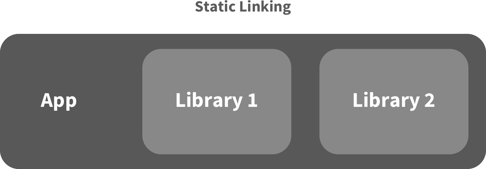
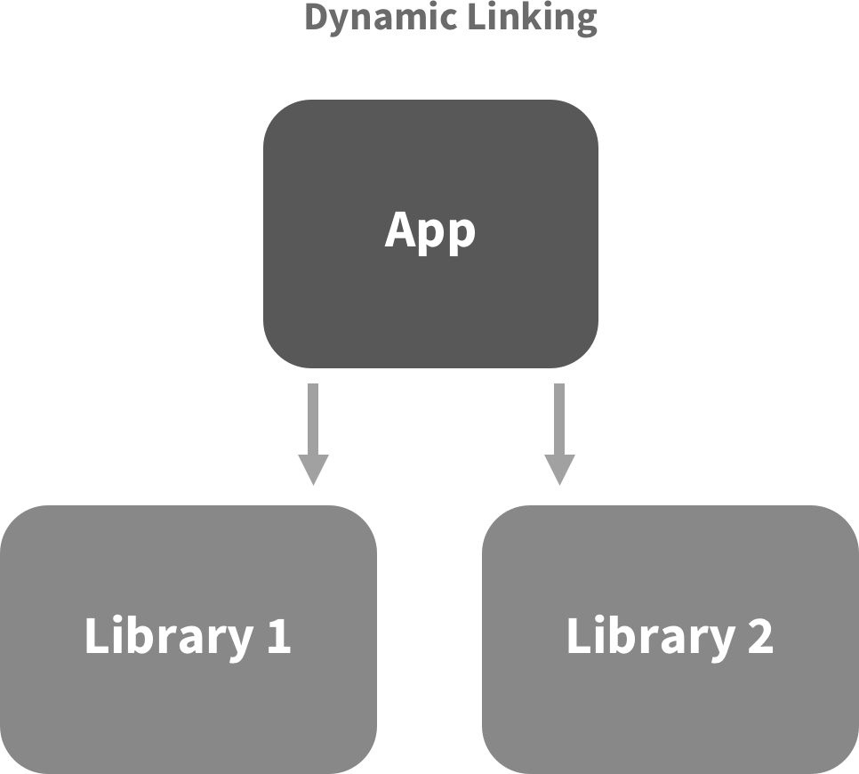
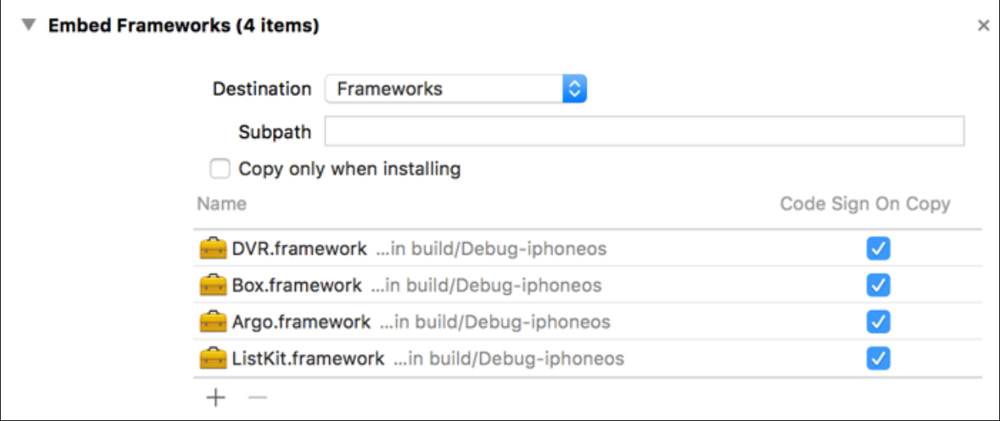

# Intro to Dependency Mangement

## Objectives

- Understand the need for having a dependency manager in iOS
- Explore the different options for package mangers in iOS (SPM, Cocoapods, Carthage)
- Use a package manger to manage your projects
- Introduction to Libraries & Frameworks 
- Dynamic vs. Static Linking
- Manual Dependency Management
- Cocoapods / Carthage

## Class Materials

Slides:

[Package Managers Slides](pm.key)

## Introduction to Libraries & Frameworks 
Collections of code that allows us to use pre-existing functionality

**Libraries**: A set of functionality that you can call when needed,
e.g. a matrix multiplication library

**Frameworks**: A framework is a bundle (Directory structure) that contains shared libraries as well as sub directories of headers and other resources files(such as images, fonts, or language files)

## Dynamic(Shared) vs. Static Linking

**Static Linking**:

- All dependencies are copied into the
executable of the program at compile time

- Because the library's code is added directly to the linked target's binary, any update to the code in the library, the linked target would also have to be rebuilt.

- **Pros:**
    - Reduces dependencies on the environment in which application will run

- **Cons:**
    - Increases app size, 
    - Can’t share dependencies 
    - Cannot update dependencies after binary has shipped

**Dynamic Linking**:

- Only references to dependencies are stored in executable. Dependencies themselves are loaded dynamically at runtime

- **Pros:**
    - Reduces app size
    
    - Libraries can be shared eg. When you have and app and an app extension, rather than putting the code in the target for both, the code would be put in a framework and linked dynamically from both the app and the extension.
    
    - Libraries can be updated after binary shipped.
    
    - Versioning - Multiple versions of the framework can be included in the same bundle ensuring backward compatibility.

- **Cons:**
    - More uncertainty about environment in which application will run

### Static vs Dynamic on iOS

- System Frameworks (e.g. UIKit) are all linked dynamically, this
way they can be updated without resubmitting an app

- Third party dependencies can be linked dynamically and
statically since iOS 8, prior only static libraries were allowed.

- Swift code can currently only be shipped as dynamic
framework, not as static library!

### Differences between Frameworks and Libraries

- Inversion of Control is a key differentiator between a framework and a library. 
When we call a method from a library we are in control, but with a framework the control is inverted, the framework calls our code. (E.g a UI framework calls our code through the event handlers (UIKit))

- A framework embodies some abstract design with more behavior built in. In order to use it, we need to insert our behavior into various places in the framework either by subclassing or by plugging in our code. The framework code then calls our code at these points.

- A framework can also be considered as an extensible skeleton where the application defines the meat of the operation by filling out the skeleton.

## Carthage / Cocoapods / SwiftPackageManager

Currently the three most popular dependency managers for iOS

**Cocoapods and Carthage** have been around for a couple of years and are maintained by a thirdparty. They are both open source

**SwiftPackageManager** is new to iOS since Swift 3 and is maintained by Apple and the open source community

- Allows you to define the name of the dependency and optionally a version number and will resolve dependencies of your decencies automatically

- Provide simple commands to update to latest version of your
dependencies

### Carthage

- Only supports dynamic frameworks, can only be used with
apps that ship to iOS 8.0 or later

- Lightweight approach: It downloads your dependencies and
compiles the frameworks, but you still need to add them to
your project manually

### Cocoapods

- Supports both dynamic frameworks and static libraries

- Integrated approach: Downloads the dependencies and restructures your project so that dependencies can be
imported right away

### SwiftPackageManger

- Comes with Swift 3, no need to download other sofware

- It’s integrated with the Swift build system and automates the process of downloading, compiling, and linking dependencies.

## Manual Dependency Management

You will need to do the last step(3) if you are using a package manager like Carthage.

1. Download project / add it as a Git submodule
2. Add project to your existing project
3. Add framework to project settings

**Pros**:
- No setup needed to integrate to project

**Cons**: 
- Need to maintain dependencies of your dependencies manually
- Non-trivial to update to new versions of your dependencies

## Summary

- It’s recommended to use a dependency manager on iOS -
Carthage and Cocoapods and SwiftPackageManager are the most popular ones.

# Next - [Dependency Manager Setup](dependency-manager-setup.md)

## Resources

[CocoaPods Documentation](https://cocoapods.org/about)

[Swift Package Manager](https://swift.org/package-manager/#example-usage)

[Carthage](https://github.com/Carthage/Carthage)